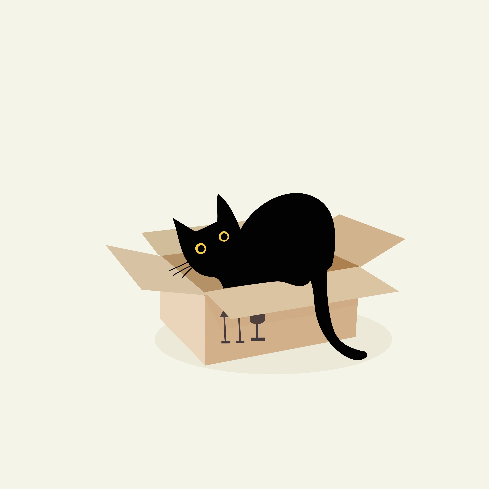

# 🌸 Sumbul Rizvi - Digital Resume

Welcome to my interactive, quirky, and beautifully-coded digital portfolio made with 💖, Tailwind CSS, and a bit of caffeine!

## 💼 What This Is

A web-based resume to showcase my journey as a:

- 🎯 Project Management Associate  
- 🧠 UX Researcher  
- 📊 Data Enthusiast  
- 😺 Professional Cat Herder (unofficial title)

> Why settle for boring PDFs when your resume can have a gradient, emojis, and animated sass?

## 📸 Screenshots

## 🚀 Features

- Fullscreen responsive layout with Tailwind CSS
- Personalized design with fun emojis and real-world project stats
- Live, scrollable portfolio section
- Aesthetic vibes from Unsplash and GitHub-hosted assets
- A footer that finally tells the truth about coffee addiction ☕

## 🔧 Tech Stack

- HTML + Tailwind CSS
- Hosted on GitHub Pages
- Designed with love, mistakes, and many Figma drafts

## 🖼️ Image Credits

- **Background Image:** [View on GitHub](https://github.com/rizzi-uwu/sumbul-rizvi-resume/blob/main/wp4804747-iphone-morbid-angek-wallpapers.jpg)
- **Profile Placeholder:** [Box Image](https://github.com/rizzi-uwu/sumbul-rizvi-resume/blob/main/box-8702500.jpg)

## 📬 Contact

- 📧 [sumbulrizvi10092000@gmail.com](mailto:sumbulrizvi10092000@gmail.com)
- 🌐 [LinkedIn](https://www.linkedin.com/in/sumbul-rizvi-iugermany)
- 🏡 Based in Berlin, Germany 🇩🇪

---

> “If your resume doesn’t sparkle, how will your work?” ✨  
> — Definitely Not Steve Jobs

